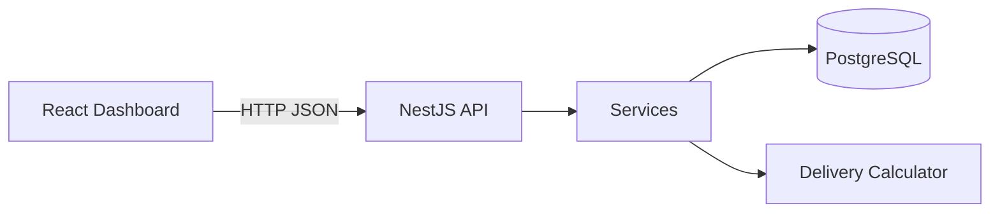
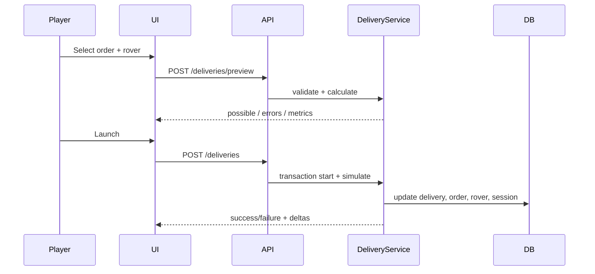

# Moon Courier Crisis

**Survive 7 lunar days. Deliver cargo. Don't crash the base.**

Moon Courier Crisis is a small but complete game simulator: you manage a lunar delivery base, assign rovers to orders across hazardous zones, and balance money, score, and base rating under battery, capacity, and risk constraints.

Built as a polished technical test project — clear domain modeling, validated business rules, migrations, seed data, unit tests, Swagger docs, Docker Compose, and a dark lunar React dashboard.

---

## Table of contents

- [Overview](#overview)
- [Features](#features)
- [Tech stack](#tech-stack)
- [Architecture](#architecture)
- [Domain model](#domain-model)
- [Gameplay loop](#gameplay-loop)
- [Game rules](#game-rules)
- [API](#api)
- [Database](#database)
- [Running locally](#running-locally)
- [Docker](#docker)
- [Testing](#testing)
- [Project structure](#project-structure)
- [AI usage](#ai-usage)
- [Trade-offs](#trade-offs)
- [Future improvements](#future-improvements)

---

## Overview

You run a courier outpost on the Moon. Orders appear for destinations across crater, ridge, dust, and dark-side terrain. Each rover has battery, cargo capacity, speed, and risk resistance. Before launch, the backend computes distance, battery cost, travel time, risk, and reward — and blocks impossible deliveries with clear business errors.

The objective is simple and measurable:

> **Survive 7 lunar days and maximize money/score while keeping base rating above zero.**

Win by finishing Day 7 with base rating > 0. Lose if base rating hits 0.

---

## Features

- Interactive SVG lunar map (zones, routes, order destinations, rover positions)
- Order panel with urgency, weight, reward, risk, and status
- Rover strip with battery bars and statuses (`AVAILABLE` / `BUSY` / `DAMAGED` / `CHARGING`)
- Live delivery preview with capacity and battery validation
- Launch animation and immediate simulated delivery result
- Day progression: expire orders, recharge batteries, spawn new orders, random events
- Game over screen with letter grade (S / A / B / C / D) and Play Again
- Seeded scenarios that deliberately demonstrate:
  - cargo too heavy for some rovers
  - insufficient battery for a long Dark Side haul
- NestJS API with DTO validation, business error codes, and Swagger
- PostgreSQL + TypeORM with migrations (`synchronize: false`)
- Jest unit tests for capacity, battery, risk, delivery, and game progression
- Docker Compose for Postgres, backend, and frontend

---

## Tech stack

| Layer | Technologies |
|-------|----------------|
| Backend | Node.js, NestJS, TypeScript, PostgreSQL, TypeORM, class-validator, class-transformer, Jest, Swagger/OpenAPI |
| Frontend | React, TypeScript, Vite, TanStack Query, Axios, Tailwind CSS |
| Infrastructure | Docker, Docker Compose |

**Not used (by design):** Prisma, MongoDB, Redis, RabbitMQ, microservices, Kubernetes.

---

## Architecture

Single NestJS backend + single React frontend. Domain logic lives in services; controllers stay thin.

```text
moon-courier-crisis/
├── src/                          # NestJS API
│   ├── entities/                 # TypeORM entities + BaseEntity
│   ├── modules/                  # game, delivery, zone, route, rover, order, event
│   ├── database/                 # DataSource, migrations, seed
│   ├── common/                   # enums, exceptions, filters
│   └── config/
├── frontend/                     # Vite + React dashboard
├── docker-compose.yml
├── Dockerfile
├── .env.example
└── README.md
```



### Request flow (delivery)



---

## Domain model

| Entity | Purpose |
|--------|---------|
| **GameSession** | Campaign state: day, money, score, base rating, status (`ACTIVE` / `WON` / `LOST`), temporary event modifiers |
| **Zone** | Map node with `x`/`y`, terrain, risk multiplier, speed multiplier |
| **Route** | Directed edge between zones: distance + base risk |
| **Rover** | Battery (0–100), capacity, speed, consumption, risk resistance, status, current zone |
| **Order** | Destination, weight, reward, urgency, risk, status, expiry |
| **Delivery** | Computed metrics + outcome for an order/rover pair |
| **GameEvent** | Random event with title, description, and JSON effects |

Shared map data: **Zone**, **Route** (seeded once).  
Per session: **GameSession**, **Rover**, **Order**, **Delivery**, **GameEvent** (Play Again creates a fresh session).

All entities extend `BaseEntity` (`id`, `createdAt`, `updatedAt`).

---

## Gameplay loop

1. See available orders on the map and in the order panel
2. Select an order
3. Select a rover
4. Backend previews whether delivery is possible
5. Backend calculates distance, battery cost, travel time, risk, reward
6. Review the delivery preview (or clear blocking errors)
7. Launch the rover
8. Delivery is simulated immediately (no real-time wait)
9. Success or failure updates money, score, rating, battery, statuses
10. Advance days until Day 7 ends — or rating collapses

---

## Game rules

### Capacity

A rover cannot carry cargo above `maxCapacity`.

```text
if cargoWeight > rover.maxCapacity → CARGO_TOO_HEAVY
```

Equal capacity is allowed.

### Battery

```text
loadRatio        = cargoWeight / rover.maxCapacity
loadMultiplier   = 1 + loadRatio * 0.5
terrainMultiplier = clamp(1 / zone.speedMultiplier, 0.8, 1.5)

batteryCost = round(
  distance * rover.baseConsumption * loadMultiplier * terrainMultiplier
)

# during SOLAR_STORM:
batteryCost = round(batteryCost * 1.2)
```

Blocked when `batteryCost > rover.battery` → `INSUFFICIENT_BATTERY` with required vs current battery.

### Travel time (minutes)

```text
travelTime = ceil(distance / (rover.speed * zone.speedMultiplier))
```

Dust storm on the destination zone can reduce effective speed further.

### Risk (clamped 1–95)

```text
loadRisk      = loadRatio * 15
batteryRisk   = battery < 30 ? 20 : battery < 50 ? 10 : 0
zoneRiskBonus = (zone.riskMultiplier - 1) * 20

finalRisk = clamp(
  route.baseRisk
  + order.risk
  + loadRisk
  + batteryRisk
  + zoneRiskBonus
  - rover.riskResistance
  + eventRiskBonus,
  1,
  95
)
```

### Success / failure

```text
successChance = 100 - finalRisk
success       = random() * 100 < successChance
```

| Outcome | Effects |
|---------|---------|
| Success | Delivery `COMPLETED`, order `DELIVERED`, rover `AVAILABLE`, battery decreases, money += reward (×1.2 if Lucky Signal), score += floor(reward/2), base rating +1 (cap 100) |
| Failure | Delivery `FAILED`, order `FAILED`, battery still decreases, score −20, base rating −5 (floor 0); high risk may set rover `DAMAGED` |

### Game progression

- Campaign length: **7 days**
- `POST /game/next-day`:
  - expire overdue `PENDING` orders
  - clear day-scoped storm modifiers
  - recharge eligible rovers (+15 battery; undamage soft)
  - increment day (or finalize win after Day 7)
  - generate 2–4 new orders
  - ~40% chance of a random event
- **Win:** reach end of Day 7 with base rating > 0
- **Lose:** base rating ≤ 0
- Letter grade from final score: **S ≥ 800**, **A ≥ 600**, **B ≥ 400**, **C ≥ 200**, else **D**

### Seeded demo scenarios

| Scenario | Order | Rover | Expected |
|----------|-------|-------|----------|
| Capacity trap | Red Valley, weight **45** | Apollo (cap 30) / Scout (cap 15) | `CARGO_TOO_HEAVY` |
| Battery trap | Dark Side, weight **48**, long route | Luna (battery 65) | `INSUFFICIENT_BATTERY` |

### Random events

| Event | Effect |
|-------|--------|
| Solar Storm | Battery consumption +20%, route risk +10 |
| Dust Storm | Selected zone speed −30%, risk +20 there |
| Lucky Signal | Next successful delivery pays +20% reward |
| Equipment Failure | One available rover becomes `DAMAGED` |
| Communication Failure | Mild risk bonus / uncertainty flavor |

---

## API

Base URL: `http://localhost:3000`  
Swagger UI: [http://localhost:3000/api](http://localhost:3000/api)

| Method | Path | Description |
|--------|------|-------------|
| `GET` | `/game` | Active session HUD + stats |
| `POST` | `/game` | Create new session (Play Again) |
| `GET` | `/game/map` | Zones + routes |
| `GET` | `/game/orders` | Session orders |
| `GET` | `/game/rovers` | Session rovers |
| `GET` | `/game/events` | Session events |
| `POST` | `/game/next-day` | Advance lunar day |
| `POST` | `/deliveries/preview` | Dry-run metrics / errors (**no mutation**) |
| `POST` | `/deliveries` | Start + simulate delivery (transaction) |
| `GET` | `/deliveries` | List deliveries |
| `GET` | `/deliveries/:id` | Delivery detail |

### Preview response shape

```json
{
  "possible": true,
  "distance": 28,
  "cargoWeight": 18,
  "batteryCost": 20,
  "travelTime": 32,
  "risk": 26,
  "reward": 240,
  "warnings": ["Medium risk"],
  "errors": []
}
```

Impossible preview example:

```json
{
  "possible": false,
  "errors": [
    {
      "code": "INSUFFICIENT_BATTERY",
      "message": "Required battery: 76%. Current battery: 65%."
    }
  ]
}
```

### Business error codes

| Code | Meaning |
|------|---------|
| `ORDER_NOT_FOUND` | Order id missing |
| `ROVER_NOT_FOUND` | Rover id missing / wrong session |
| `ORDER_ALREADY_DELIVERED` | Duplicate delivery |
| `ORDER_NOT_AVAILABLE` | Not `PENDING` |
| `ROVER_NOT_AVAILABLE` | Not `AVAILABLE` |
| `CARGO_TOO_HEAVY` | Weight exceeds capacity |
| `INSUFFICIENT_BATTERY` | Battery cost exceeds charge |
| `ROUTE_NOT_FOUND` | No Base → destination route |
| `GAME_ALREADY_FINISHED` | Session not `ACTIVE` |
| `GAME_NOT_FOUND` | No session |
| `DELIVERY_NOT_FOUND` | Delivery id missing |

Stack traces are never returned to the client.

---

## Database

- **Engine:** PostgreSQL
- **ORM:** TypeORM
- **Config:** environment variables (`DATABASE_HOST`, `DATABASE_PORT`, `DATABASE_USER`, `DATABASE_PASSWORD`, `DATABASE_NAME`)
- **`synchronize: false`** in all environments — schema changes go through migrations only

Migrations:

```text
src/database/migrations/
├── 1710000000000-InitSchema.ts
└── 1710000000001-AddBaseEntityTimestamps.ts
```

Seed (`yarn seed`) creates:

- 6 zones + sparse bidirectional routes
- one active game session
- 3 rovers (Apollo, Luna, Scout)
- multiple orders including capacity/battery demo cases

---

## Running locally

### Prerequisites

- Node.js **20+**
- Yarn
- PostgreSQL (local install or Docker)

### 1. Environment

```bash
cp .env.example .env
```

Example:

```env
DATABASE_HOST=localhost
DATABASE_PORT=5432
DATABASE_USER=postgres
DATABASE_PASSWORD=postgres
DATABASE_NAME=moon_courier
PORT=3000
NODE_ENV=development
VITE_API_URL=http://localhost:3000
```

Create the database if it does not exist:

```bash
createdb moon_courier
# or
psql -U postgres -c "CREATE DATABASE moon_courier;"
```

### 2. Backend

```bash
yarn install
yarn migration:run
yarn seed
yarn start:dev
```

- API: [http://localhost:3000](http://localhost:3000)
- Swagger: [http://localhost:3000/api](http://localhost:3000/api)

### 3. Frontend

```bash
cd frontend
yarn install
yarn dev
```

- UI: [http://localhost:5173](http://localhost:5173)  
  (Vite proxies `/game` and `/deliveries` to the API in development)

---

## Docker

Full stack:

```bash
docker compose up --build
```

| Service | URL / port |
|---------|------------|
| Frontend | [http://localhost:5173](http://localhost:5173) |
| Backend | [http://localhost:3000](http://localhost:3000) |
| Postgres | `localhost:5432` |

Compose starts Postgres, runs migrations + seed on backend boot, then serves the API and built frontend.

---

## Testing

```bash
yarn test
```

Focused coverage:

| Area | What is asserted |
|------|------------------|
| Capacity | below / equal / above max capacity |
| Battery | sufficient / exact / insufficient (incl. Dark Side haul) |
| Risk | calculation, clamp 1–95, resistance reduces risk |
| Delivery | valid start, busy rover blocked, delivered order blocked, battery blocked |
| Game | next day increments, expiry handled, ends after Day 7 |

```bash
yarn test:cov   # coverage report
yarn lint       # ESLint
yarn build      # Nest compile
cd frontend && yarn build
```

---

## Project structure

```text
src/
├── entities/                 # Shared TypeORM models
│   ├── base/base.entity.ts
│   ├── game-session.entity.ts
│   ├── zone.entity.ts
│   ├── route.entity.ts
│   ├── rover.entity.ts
│   ├── order.entity.ts
│   ├── delivery.entity.ts
│   └── game-event.entity.ts
├── modules/
│   ├── game/                 # session, map, next-day, events
│   ├── delivery/             # preview, start, simulate, risk calc
│   ├── zone|route|rover|order|event/
├── database/                 # DataSource, migrations, seed
├── common/                   # enums, BusinessException, filters
└── config/

frontend/
├── src/
│   ├── api.ts
│   ├── App.tsx
│   └── components/           # Hud, LunarMap, Orders, Rovers, Preview, Modals
```

Barrel `index.ts` files exist in key folders for cleaner imports.

---

## AI usage

AI (Cursor) was used as a coding assistant for:

- NestJS / TypeORM boilerplate and module scaffolding
- Test-case brainstorming and Jest setup
- React dashboard layout and lunar styling ideas
- Docker Compose wiring and README drafting
- Refactors (shared `BaseEntity`, entity folder layout, barrel exports)

**Manually designed, reviewed, and verified:**

- Core formulas (battery, travel time, risk)
- Seed scenarios that expose capacity and battery failures
- Win / lose / grading rules
- API contracts and business error codes
- Consistency across database → backend → API → frontend

Generated code was reviewed and adjusted so domain rules stay in services, controllers stay thin, and migrations remain the source of truth for schema.

---

## Trade-offs

| Choice | Why |
|--------|-----|
| Monolithic NestJS | Keeps the technical test readable and easy to run — no microservice tax |
| PostgreSQL + TypeORM | Relational model fits sessions, routes, and deliveries; migrations stay explicit |
| No Prisma | Matches the required stack; TypeORM relations + DI fit Nest naturally |
| Immediate delivery simulation | This is a game, not a logistics scheduler — preview then resolve in one transaction |
| Custom SVG map | Enough to show zones/routes/rovers without an external map API |
| Deterministic formulas + injectable RNG | Preview stays explainable; unit tests can force success/failure |
| Sparse route graph | Simpler than full pathfinding; most orders ship Base → destination |

---

## Future improvements

- Authentication and persistent player profiles
- WebSockets for live transit animation across the map
- Multi-hop pathfinding on the sparse graph
- Richer multi-day event chains
- End-to-end Playwright tests
- CI/CD pipeline (lint, test, build, migrate)

---

## Quick start (TL;DR)

```bash
cp .env.example .env
# create DB: moon_courier

yarn install
yarn migration:run
yarn seed
yarn start:dev

# new terminal
cd frontend && yarn install && yarn dev
```

Open [http://localhost:5173](http://localhost:5173) — pick an order, pick a rover, preview, launch, survive Day 7.

---

*Moon Courier Crisis — deliver under pressure.*
